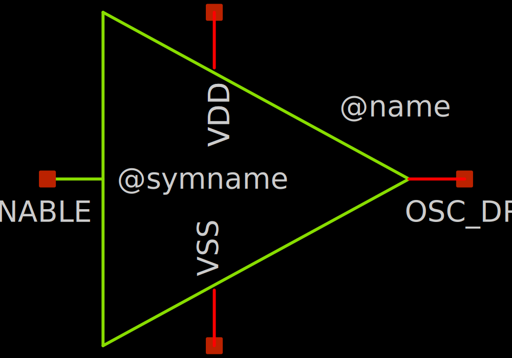
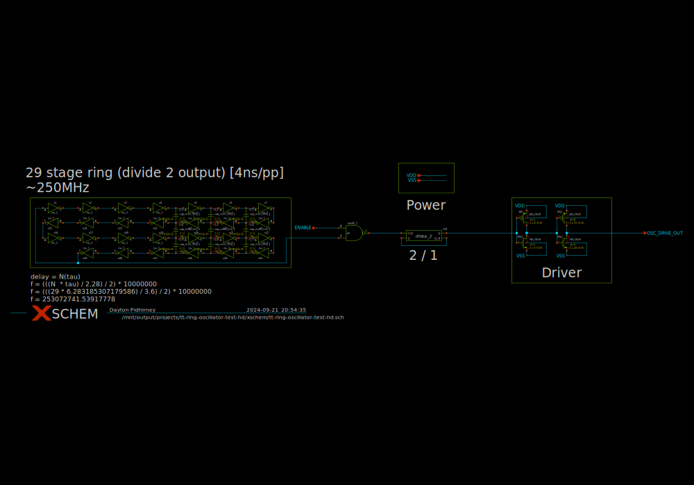

# tt-ring-oscillator-test-hd

- Description: A Dual Ring Oscillator utilizing two different PDK libraries (HD, SC) [HD TEST]
- PDK: sky130A

## Authorship

- Designer: Dayton Pidhirney
- Company: N.A
- Created: Sep 16, 2024
- License: Apache 2.0
- Last modified: None

## Pins

- VDD
  + Description: Positive analog power supply
  + Type: power
  + Direction: inout
  + Vmin: 1.7
  + Vmax: 1.8
- VSS
  + Description: Analog ground
  + Type: ground
  + Direction: inout
- ENABLE
  + Description: Oscillator enable signal
  + Type: digital
  + Direction: input
  + Vmin: 1.7
  + Vmax: 1.8
- OSC_DRIVE_OUT
  + Description: Voltage output
  + Type: signal
  + Direction: output

## Default Conditions

- ENABLE
  + Description: Enable signal
  + Display: enable
  + Unit: V
  + Typical: 1.8
- OSC_DRIVE_OUT
  + Description: Oscillator Output Signal
  + Display: OSC_DRIVE_OUT
  + Unit: V
  + Typical: 1.8
- VDD
  + Description: Analog power supply voltage
  + Display: VDD
  + Unit: V
  + Typical: 1.8
- VSS
  + Description: Analog ground
  + Display: VSS
  + Unit: V
  + Typical: 0
- cl
  + Description: Output load capacitance
  + Display: CLoad
  + Unit: pF
  + Maximum: 1
- corner
  + Description: Process corner
  + Display: Corner
  + Typical: tt
  + Minimum: ss
  + Maximum: ff
- temperature
  + Description: Ambient temperature
  + Display: Temp
  + Unit: °
  + Typical: 27
- iterations
  + Description: Iterations to run
  + Display: Iterations
  + Minimum: 1
  + Maximum: 1
  + Step: linear
  + Stepsize: 1

## Symbol

## Schematic

