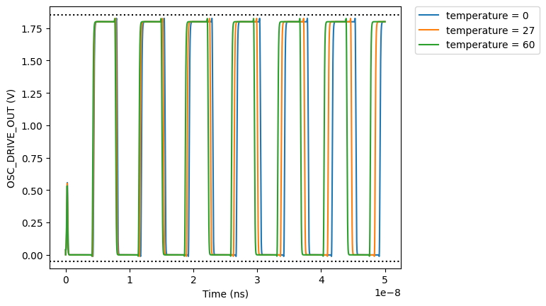

# CACE Summary for tt-ring-oscillator-test-hd

**netlist source**: schematic

|      Parameter       |         Tool         |     Result      | Min Limit  |  Min Value   | Typ Target |  Typ Value   | Max Limit  |  Max Value   |  Status  |
| :------------------- | :------------------- | :-------------- | ---------: | -----------: | ---------: | -----------: | ---------: | -----------: | :------: |
| Enable Signal        | ngspice              | ENABLE               |           1.7 V |    1.800 V |        1.8 V |    1.800 V |        1.8 V |    1.800 V |   Pass ✅    |
| Oscillator Output    | ngspice              | OSC_DRIVE_OUT        |         -0.05 V |   -0.012 V |          any |    0.104 V |       1.85 V |    1.826 V |   Pass ✅    |

## Plots

## transient

